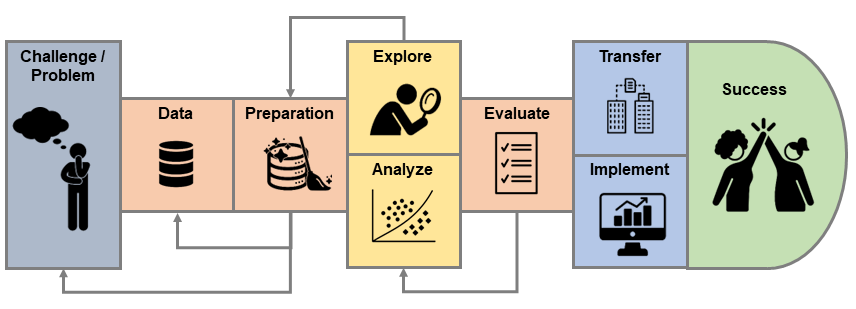

# Einführung {#intro}

In diesem Kapitel geht es darum zu verstehen, was ML überhaupt ist, warum es nützlich sein kann und was typische Anwendungsfälle von ML sind. Wir werden ausserdem verschiedene Unterkategorien von ML kennen lernen.

## Was ist Machine Learning?

<!-- Kurze Geschichte von ML -->
<!-- Schon lange, seit 1950er / 1960er -->
<!-- Viel gemacht von Statistiker*innen -->
<!-- Computing Power -->
<!-- Algorithmische Kniffs -->
<!-- Generalization! -->

Im Prinzip geht die Geschichte des MLs weit zurück, nämlich zu den Anfängen der Statistik. Viele Modelle, die heutzutage im ML angewendet werden sind nämlich eigentlich von Statistiker\*innen erfundene Modelle. Die Geschichte des MLs und der Statistik sind darum eng verknüpft. Einen eigentlichen Startpunkt des MLs könnte man vielleicht in den 1960er Jahren ausmachen, mit den Arbeiten von Frank Rosenblatt^[https://en.wikipedia.org/wiki/Frank_Rosenblatt], welcher das sogenannte **Perceptron** und einen dazugehörigen Lernalgorithmus prägte (dazu später mehr). Danach blieb es aber rund 20 Jahre relativ ruhig bis die Forschung im Bereich Machine Learning so richtig Fahrt aufnahm. Ein grosser Schub für die Entwicklung von ML ging vom Aufkommen von extrem grossen Datenmengen (**Big Data**) und dem Internet aus. Das führte nämlich dazu, dass sich immer mehr Leute aus den Fachbereichen Informatik und Computer Science mit dem Thema ML befassten und effiziente Hard- und Software sowie algorithmische Kniffs und Tricks beisteuerten. Ausserdem ermöglichte das Internet den Zugang zu gewaltigen Datenmengen an Bildern, Videos, Klicks, etc. - denken Sie beispielsweise nur schon an die Informationen, die jede\*r von uns tagtäglich im Internet hinterlässt. Ein weiterer Schub für das Machine Learning war (und ist) zudem die immer besser werdende Rechenleistung von Computern. Diese Entwicklungen haben sich im November 2022 kulminiert in der erstmaligen breiten öffentlichen Wahrnehmung von sogenannten **Large Language Models** wie ChatGPT.

Wie der Name sagt, geht es im ML darum, dass eine Maschine (oder präziser, ein Computer) aus einem gegebenen Datensatz automatisch Muster lernt, ohne dass ein Mensch dem Computer (explizit) sagen muss, was er lernen soll. Der Mensch gibt jedoch dem Computer die Rahmenbedingungen für das selbständige Lernen vor. Die erlernten Muster sind selbstverständlich nur nützlich, wenn sie **genereller Natur** sind und auch für neue bzw. zukünftige Beobachtungen gelten. Beispiel: ein Spital hat während der Corona Pandemie ein Modell trainiert, um den täglichen Pflegebedarf je nach Wochentag, Saison, und weiteren Indikatoren vorherzusagen. Das Modell funktioniert nun nach der Pandemie aber nicht wunschgemäss und prognostiziert in der Tendenz einen zu hohen Pflegebedarf. Das Problem ist, dass die erlernten Muster nicht gut auf eine Zeit nach der Pandemie generalisierbar sind. Mit anderen Worten: die Trainingsdaten waren nicht repräsentativ genug.

Bevor wir etwas konkreter anschauen, wie genau ein Computer selbständig aus Daten lernen kann, schauen wir uns die Definitionen von zwei Experten im Gebiet ML an:

::: {.rmdnote}
*"[Machine Learning is the] field of study that gives computers the ability to learn without being explicitly programmed."* Arthur Samuel, 1959

*"Machine Learning is the science (and art) of programming computers so they can learn from data."* Aurélien Géron^[Aurélien Géron. (2019). Hands-On Machine Learning with Scikit-Learn, Keras, and TensorFlow: Concepts, Tools, and Techniques to Build Intelligent Systems. Sebastopol: O’Reilly Media Inc. 3rd Edition.]
:::

Zusammenfassend lässt sich sagen, dass wir mit ML dem Computer die Möglichkeit geben, automatisch und selbständig aus Daten zu lernen. Nichtsdestotrotz braucht es Sie als ML-Expert*in, und zwar wie folgt:

1. Sie entscheiden sich für ein spezifisches ML Modell. Typischerweise kann ein ML Modell durch eine mathematische Funktion (siehe Kapitel \@ref(basics)) charakterisiert werden. ML Modelle können unterschiedlich flexibel sein und es liegt im Ermessen von Ihnen, wie flexibel das Modell sein soll. Sie müssen bei der Wahl des Modells die Komplexität des Problems berücksichtigen. Grundsätzliche gilt bei der Wahl des Modells, dass flexiblere Modelle komplexere Sachverhalte abbilden können. Ein zu flexibles Modell kann aber zu Overfitting führen, aber dazu später mehr. Dieser Schritt wird im Fachjargon typischerweise **Model Selection** (Modelauswahl) genannt.
2. Sobald Sie das Modell ausgewählt haben, übergeben Sie dem Computer (etwas vereinfacht gesagt) das Modell, einen Datensatz sowie einen Lernalgorithmus. Nun hat der Computer alle Zutaten, um automatisch zu lernen. Doch was lernt er eigentlich? Der Computer lernt die Parameter Ihres gewählten Modells, so dass das Modell sich optimal an die Daten anpasst. Dieser Schritt wird im Fachjargon **Model Training** (Trainieren des Modells) genannt.
3. Falls Sie mit dem erlernten Modell zufrieden sind, können Sie es nun entweder dazu verwenden Vorhersagen zu machen oder um Zusammenhänge in den Daten zu interpretieren und daraus wertvolle Einsichten gewinnen. Dieser Schritt wird im Fachjargon als **Model Inference** (Modellinferenz) zusammengefasst. Typischerweise sind Sie in der Realität mit dem ersten erlernten Modell allerdings noch nicht zufrieden und gehen zurück zu Schritt 1 und wählen ein anderes Modell.

Es handelt sich bei dieser Vorgehensweise um eine sehr allgemeine Beschreibung des Machine Learning Prozesses. Wie diese drei Schritte konkret funktionieren, werden Sie in den nachfolgenden Kapiteln dieses Buchs erfahren.

## Wann macht es Sinn ML einzusetzen?

Ein ML Modell zu trainieren kann viel Zeit und Geld kosten. Zum Beispiel müssen Sie unter Umständen überhaupt erst die Daten sammeln (oder von einem Datendienstleister kaufen), um ein Modell zu trainieren. Oder das Projekt ist so komplex, dass Sie als Analyst*in unzählige Stunden benötigen, um die Daten überhaupt erst in eine Form zu bringen, die es erlaubt ein Modell zu trainieren. Für neuartige DL Modelle oder Generative KI kann das Trainieren bzw. Lernen eines Modells durch den reinen Stromverbrauch bzw. die vom Cloud-Betreiber in Rechnung gestellten Kosten so hoch sein, dass sich Ihr ursprüngliches Vorhaben nicht mehr lohnt. Es ist also ungemein wichtig, dass Sie sich vor Projektbeginn gut überlegen, ob ML für Ihr vorliegendes Problem überhaupt Sinn macht und einen Mehrwert generieren kann. 

Folgende Daumenregeln^[siehe auch Seiten 6 - 7 in Aurélien Géron. (2019). Hands-On Machine Learning with Scikit-Learn, Keras, and TensorFlow: Concepts, Tools, and Techniques to Build Intelligent Systems. Sebastopol: O’Reilly Media Inc. 3rd Edition.] können Ihnen dabei helfen, zu entscheiden, ob ML für Ihr Projekt Sinn macht:

* Ihr Problem entspricht einem Standard ML-Problem, das bereits mehrfach gelöst wurde und für das es sogenannte "off-the-shelf" Lösungen gibt. Beispiel: Sie wollen das Sentiment (positive vs. negative Grundhaltung) von Social Media Posts über Ihr Unternehmen automatisch klassifizieren. Dazu gibt es viele vortrainierte Modelle, die teilweise gratis verwendet werden können.
* Der manuelle Arbeitsaufwand ist sehr gross, wenn das Problem durch Menschen gelöst werden soll. Das Problem ist aber ansonsten klar strukturiert und benötigt keinen grossen kognitiven Einsatz eines Menschen. Beispiel: In den Post-Verteilzentren werden die von Hand geschriebenen Postleitzahlen (PLZ) problemlos mittels Computer bzw. ML Modellen erkannt und "gelesen" und die Briefe und Pakete entsprechend sortiert.
* Komplexe Probleme, in denen ein Mensch keinen Überblick hat, weil so grosse und komplexe Datenmengen vorhanden sind. Wir Menschen haben grosse Mühe damit, in Rohdaten (reinen Datentabellen) irgendwelche Muster zu erkennen. In diesem Fall können wir entweder versuchen, die Daten zu visualisieren oder mithilfe von ML Zusammenhänge zu lernen, die wir sonst nicht erkennen könnten. Ein illustratives Beispiel ist das Anscombe Quartett^[https://de.wikipedia.org/wiki/Anscombe-Quartett], das vier kleine Stichproben mit jeweils elf Datenpunkten enthält. Jeder Datenpunkt wird durch eine $x$ und eine $y$ Variable beschrieben. Die vier $x$- sowie die vier $y$-Variablen haben identische Mittelwerte. Erst eine einfache Visualisierung der vier Stichproben mithilfe eines Streudiagramms zeigt die Muster sowie die Unterschiede zwischen den vier Stichproben deutlich auf. 

```{r anscombe, echo=FALSE, eval=TRUE}
# Die Daten als Tabelle
print(anscombe)
# Plot Einstellungen
par(mfrow = c(2, 2), mar = c(4, 4, 0.5, 0.5), oma =  c(0, 0, 2, 0))
# Alle Plots in Loop (siehe R Dokumentation zu anscombe)
ff <- y ~ x
for(i in 1:4) {
  ff[2:3] <- lapply(paste0(c("y","x"), i), as.name)
  plot(ff, data = anscombe, col = "darkgreen", pch = 21, bg = "green", cex = 1.2, xlim = c(3, 19), ylim = c(3, 13))
}
```

## Anwendungsfälle von ML

In diesem Abschnitt stelle ich erfolgreiche Anwendungsfälle von ML vor. Einige davon treffen Sie womöglich tagtäglich in Ihrem Alltag an:

* **Spam Filter** sind ein frühes Beispiel einer erfolgreichen Anwendung von ML. Ein Klassifikationsmodell entscheidet dabei automatisch aufgrund der Inhalte einer Email, des Betreffs sowie des Absenders, ob es sich um eine Spam oder eine sogenannte Ham Email (unproblematische Email) handelt. Falls Sie gängige Email Software verwenden, dann arbeitet im Hintergrund ein Spam Filter daran, Sie vor lästigen Emails zu schützen.
* Ein grosser Teil des wirtschaftlichen Erfolgs von **Google** basiert auf der Idee, dass aufgrund der Suchhistorie hervorgesagt werden kann, welche Nutzerin oder welcher Nutzer mit welcher Wahrscheinlichkeit eine bestimmte Werbung anklickt. Dies erlaubt Google für jede Nutzer*in die Werbung mit den höchsten "Erfolgschancen" zu schalten. Da jeder Klick Einnahmen generiert, ist es für das Geschäftsmodell von Google entscheidend, dass möglichst viele Klicks stattfinden.
* Ein grosser Bereich des MLs und speziell des DLs befasst sich mit **Computer Vision**. Dabei geht es darum, das Hauptmotiv von Bildern zu klassifizieren (z.B. Zeigt ein Bild ein Tier oder einen Menschen?), Objekte in Bildern zu entdecken (z.B. Enthält das Bild eine Person?) und das entdeckte Objekt dann auch zu klassifizieren (z.B. Handelt es sich bei der Person um XY?). Als konkreteres Beispiel können Sie sich einen Industriebetrieb vorstellen, welcher ein Computer Vision Modell einsetzen möchte, um den Abnützungsgrad der von ihnen produzierten Werkzeuge automatisch zu erkennen und den Kundinnen und Kunden den optimalen Ersatzzeitpunkt für das Werkzeug vorhersagen zu können.
* Ähnlich wie im vorherigen Beispiel gibt es bereits viele Anwendungen im öffentlichen Verkehr, in denen es um **Predictive Maintenance** geht. Z.B. kann der optimale Wartungszeitpunkt für eine Weiche oder einen Gleisabschnitt aufgrund einer Vielzahl an Indikatoren und Messungen vorhergesagt werden.
* Ein grosses Einsatzgebiet für ML ergibt sich im Finanzsektor durch das automatische Erkennen von potentiell **betrügerischen Transaktionen**. Falls Sie auch schon mal eine Kreditkartentransaktion direkt am Telefon einer Kundenberaterin oder einem Kundenberater bestätigen mussten, dann ist es wahrscheinlich, dass Ihre Transaktion von einem ML System zur manuellen Überprüfung geflaggt wurde. In diesem Zusammenhang spricht man manchmal auch vom Erkennen von Anomalien (engl. *Anomaly Detection*).
* Sogenannte **Recommender Systems** sind insbesondere in Online Verkaufspunkten von grossem Nutzen. Betreiben Sie beispielsweise einen grossen Onlinehandel, dann wollen Sie Ihren Kundinnen und Kunden Produkte zum Kauf vorschlagen. Dazu verwenden Sie ein Modell, das basierend auf der Ähnlichkeit zwischen Kundinnen und Kunden potentiell interessante Produkte vorschlägt.
* Die rasanten Entwicklungen im Bereich **Natural Language Processing** (NLP) in den letzten 10 Jahren haben viele neue und interessante Anwendungsgebiete zutage gefördert. Zum Beispiel eignen sich *Large Language Models* (LLMs) als erste Anlaufstelle für Kundinnen und Kunden (automatisierter Kundenservice). LLMs werden vermutlich aber auch immer mehr in internen Prozessen in Unternehmen eingesetzt, z.B. um komplexe Dokumente zusammenzufassen oder Sitzungsprotokolle zu erstellen.

Die obige Liste ist bei weitem nicht komplett und die Entwicklungen im Bereich ML sind aktuell so rasant, dass jeden Tag eine grosse Zahl von neuen ML-basierten Produkten und Dienstleistungen auf den Markt kommen.

## Supervised vs. Unsupervised Learning

Den Unterschied zwischen dem Supervised Learning und dem Unsupervised Learning können wir am besten erklären, indem wir uns mit ein paar mathematischen Grundlagen des Machine Learnings befassen. Keine Sorge, diese Grundlagen sind sehr einfach, aber versuchen Sie, diese bereits gut zu verstehen, denn wir bauen später darauf auf.

Im **Supervised Learning** haben wir einerseits sogenannte Input-Daten und andererseits einen Output, den wir vorhersagen wollen. Für die Input-Daten gibt es ganz viele verschiedene Begriffe, die synonym verwendet werden: z.B. Features, unabhängige Variablen, Attribute, Prädiktoren. Dasselbe gilt für den Output, hier gibt es folgende Synonyme: Zielvariable, abhängige Variable, Label, oder auch einfach $y$. Unsere Konvention hier ist aber folgende: es gibt Input-Daten (oder Input-Variablen) und einen Output (oder Output-Variable).

Die Input-Daten für eine Beobachtung $i$ schreiben wir mathematisch wie folgt:

$$
\mathbf{x}_i=\begin{pmatrix} x_{i1} \\ x_{i2} \\ \vdots \\ x_{ip} \end{pmatrix},
$$ 
Diese Notation bedarf ein paar Erklärungen:

* Den Index $i$ brauchen wir, um die verschiedenen Beobachtungen zu kennzeichnen. $i$ kann eine Ganzzahl zwischen $1$ und $n$ annehmen, wobei $n$ die Anzahl Beobachtungen im Datensatz bezeichnet. Wenn wir zum Beispiel etwas über die Input-Daten der dritten Beobachtung sagen wollen, dann können wir die Notation $\mathbf{x}_3$ verwenden.
* Für jede Beobachtung $i$ haben wir insgesamt $p$ Variablen, welche die verschiedenen Attribute einer Beobachtung enthalten. $x_{i1}$ bezeichnet also die erste Variable der i-ten Beobachtung, $x_{i2}$ die zweite Variable der i-ten Beobachtung und $x_{ip}$ die p-te (letzte) Variable der i-ten Beobachtung.
* Was Sie oben sehen, ist aus mathematischer Sicht ein Spaltenvektor. Im Moment reicht es, wenn Sie wissen, dass wir mit diesem Spaltenvektor die Input-Daten einer Beobachtung *kompakt* darstellen können.

Neben den Input-Daten haben wir im Supervised Learning aber wie erwähnt auch einen Output und den bezeichnen wir üblicherweise mit $y_i$. Auch hier hilft uns der Index $i$ dabei, die Beobachtungen eindeutig zu kennzeichnen. Schauen wir uns am besten kurz ein konkretes Beispiel an:

::: {.rmdtip}
**Aufgabe**
```{r, echo=FALSE}
htmltools::includeHTML("exercises/notation.html")
```
:::

**Wichtig**: Beim Supervised Learning geht es um ML Probleme, in denen sowohl Input-Daten als auch ein Output vorhanden ist. Ziel beim Supervised Learning ist es, ein Modell zu trainieren, das basierend auf den Input-Daten möglichst gute Vorhersagen für den Output macht. Es geht also hier um Vorhersageprobleme. In einem gewissen Sinn ist der Output die überwachend Instanz (engl. Supervisor), welche den Lernprozess des Modells kontrolliert.

Im Gegensatz zum Supervised Learning haben wir im **Unsupervised Learning** nur Input-Daten und *keinen Output*. Im Unsupervised Learning geht es darum, aus den Input-Daten interessante Muster zu lernen, welche für bessere unternehmerische Entscheidungen verwendet werden können. Ein einfaches Beispiel ist das Clustering von Kundinnen und Kunden eines Unternehmens in ähnliche Kundengruppen, so dass die verschiedenen Kundengruppen gezielter mit Marketingaktionen angesprochen werden können. Techniken, um komplexe Datensätze zu visualisieren, werden typischerweise auch zum Unsupervised Learning gezählt.

Neben dem Supervised und dem Unsupervised Learning gibt es noch eine dritte Kategorie von Machine Learning, nämlich das **Reinforcement Learning** (RL). Dieser Kategorie gehören Modelle an, die (virtuelle) Agenten so trainieren, dass sie langfristig möglichst optimal handeln. Das bekannteste Beispiel aus dem RL ist Googles AlphaGo Agent, welcher den menschlichen Go Weltmeister im Jahr 2017 schlug.^[https://deepmind.google/technologies/alphago/]. Reinforcement Learning ist aber auch eine wichtige Komponente in der Optimierung von grossen Sprachmodellen wie ChatGPT. In einer ersten Fassung dieses Buchs werden wir uns nicht (oder nur am Rande) mit RL befassen.

Die Unterscheidung zwischen den drei Arten von Machine Learning ist im oberen Teil der Abbildung \@ref(fig:slulrl) visualisiert:

```{r slulrl, echo = FALSE, fig.cap = 'Die verschiedenen Kategorien des Machine Learnings und deren Hierarchie. ', out.width='90%', fig.align='center'}
knitr::include_graphics("images/SL_UL_RL.png")
```

## Regression vs. Klassifikation

In der Kategorie des Supervised Learnings unterscheiden wir weiter zwischen Regressions- und Klassifikationsproblemen (siehe auch Abbildung \@ref(fig:slulrl)).

Im Regressionsproblem ist der Output eine **stetige** Variable (Intervall- oder Verhältnisskalierung), d.h. die Variable enthält numerische Werte.

Im Klassifikationsproblem ist der Output bzw. die Zielvariable eine **kategorische** Variable (Nominal- oder Ordinalskalierung).

::: {.rmdtip}
**Aufgabe**
```{r, echo=FALSE}
htmltools::includeHTML("exercises/regvsclass.html")
```
:::

## Parametrische vs. nicht-parametrische Modelle

Ein ML Modell gehört entweder der Familie **parametrischer** Modelle oder der Familie **nicht-parametrischer** Modelle an. Dabei spielt es keine Rolle, ob wir mit dem Modell ein Regressions- oder ein Klassifikationsproblem lösen wollen.

Womöglich sind Sie in Ihrer Ausbildung bereits **parametrischen Modellen** begegnet, denn das einfache lineare Regressionsmodell ist ein typisches Beispiel für ein parametrisches ML Modell. Das Modell ist vollkommen charakterisiert durch die beiden lernbaren (optimierbaren) Parameter $w_0$ und $w_1$^[In Statistikvorlesungen werden die beiden Parameter oft eher mit $b_0$ und $b_1$ oder mit $\beta_0$ und $\beta_1$ bezeichnet. Im Machine Learning nennt man Parameter oft Gewichte (engl. Weights), weshalb die Parameter typischerweise mit $w$ bezeichnet werden.] und kann wie folgt (mathematisch) aufgeschrieben werden:

$$
\hat{y_i} = f(x_i)=w_0 + w_1 \cdot x_i
$$
Wenn Ihnen der obige Ausdruck noch fremd vorkommt, dann ist das nicht schlimm. Wir werden im Kapitel \@ref(lin-reg) ausführlich auf lineare Regressionsmodelle eingehen. Im Moment müssen Sie nur wissen, dass ein parametrisches Modell wie oben mit einer mathematischen Funktion beschrieben werden kann und dass diese Funktion durch lernbare **Parameter** (hier $w_0$ und $w_1$) charakterisiert wird.

**Nicht-parametrische Modelle** wiederum sind Modelle, welche nicht (oder zumindest nicht explizit) durch Parameter charakterisiert sind. Am besten schauen wir uns gleich ein einfaches nicht-parametrisches Modell an, nämlich das **K-Nearest-Neighbors** (KNN) Modell. Stellen Sie sich vor, Sie haben einen Datensatz mit 55 Produkten aus Ihrem Sortiment. Sie haben jedes dieser 55 Produkte auf Instagram und auf Tiktok durch Influencer\*innen bewerben lassen. Für jedes der 55 Produkte hatten Sie ein Werbebudget für Instagram ($x_{i1}$) und ein Werbebudget für Tiktok ($x_{i2}$). Am Ende des Geschäftsjahrs haben Sie für jedes der 55 Produkte bestimmt, ob die Absatzziele erreicht wurden oder nicht (Output $y_i$). Die erfolgreichen Produkte (= Absatzziel erreicht) sind in untenstehender App als blaue Punkte eingezeichnet. Die roten Dreiecke repräsentieren die nicht-erfolgreichen Produkte. Sie sehen, dass erfolgreiche Produkte tendenziell höhere Instagram und Tiktok Werbebudgets aufwiesen als nicht-erfolgreiche Produkte. Sie möchten nun ein Modell schätzen, dass die Produkte automatisch klassifizieren kann. Dazu verwenden Sie das KNN Modell, das die $K$ nächsten Nachbarn unter den 55 gegebenen Produkten sucht und dann die häufigste Beobachtung unter den $K$ nächsten Nachbarn vorhersagt. In anderen Worten: wir suchen die $K$ **ähnlichsten** Beobachtungen und nutzen diese, um eine Vorhersage zu machen.

Selbstverständlich spielt der konkrete Wert von $K$ hier eine grosse Rolle - sollen wir nur $K=1$ Nachbarn berücksichtigen? Oder $K=10$ Nachbarn? Die erste Abbildung in der App zeigt nicht nur die 55 Datenpunkte, sondern auch die **Entscheidungsgrenze** (in schwarz). Untersuchen Sie kurz, wie sich diese Entscheidungsgrenze verändert, wenn Sie $K$ erhöhen oder reduzieren.

Ausserdem können Sie in der ersten Abbildung auch den schwarzen Punkt mit der Maus setzen, wodurch Ihnen die $K$ nächsten Punkte des schwarzen Punkts angezeigt werden.

Die zweite Abbildung zeigt die Entscheidungsregionen mit unterschiedlicher Intensität je nachdem wie sicher sich das Modell ist. In einer Region, in der alle $K$ Nachbarn nicht-erfolgreiche Produkte sind, sind wir uns eher sicher bezüglich der Vorhersage als in einer Region, in der die Anteile zwischen erfolgreichen und nicht-erfolgreichen Produkten ausgeglichen sind.

```{r, echo=FALSE}
knitr::include_app("https://martin-sterchi.shinyapps.io/appKNN/", height = "600px")
```

Um die $K$ nächsten Nachbarn zu finden, müssen wir die Distanzen zwischen Punkten rechnen können. Dazu verwenden wir die Euklidische Distanz, welche wir in Kapitel \@ref(basics) kennen lernen werden.

Das KNN Modell ist ein sehr einfaches ML Modell, welches in der Praxis allerdings nicht allzu häufig angewendet wird. Warum nicht? Weil es am sogenannten **Fluch der Dimensionalität** (engl. Curse of Dimensionality) leidet. Doch was bedeutet das? Je mehr Input-Variablen wir haben, desto weiter entfernt sind Datenpunkte voneinander (das ist etwas, das man sich nur schwer vorstellen kann, aber Sie können es mir für den Moment einfach mal glauben). Das KNN beruht auf der Grundidee, dass wir $K$ nahe, ähnliche Beobachtungen für die Vorhersage verwenden. Wenn diese $K$ nahen Beobachtungen im hochdimensionalen Raum (= viele Input-Variablen) nicht mehr nahe sind, dann funktioniert auch das Modell nicht mehr gut.

::: {.rmdtip}
**Aufgaben**
```{r, echo=FALSE}
htmltools::includeHTML("exercises/knn.html")
```
:::


## Machine Learning Pipeline

Abbildung \@ref(fig:pipeline) zeigt, wie eine typische ML-Pipeline aussieht.^[Icons stammen von https://thenounproject.com/.]

```{r pipeline, echo = FALSE, fig.cap = 'Eine typische ML-Pipeline. ', out.width='90%', fig.align='center'}

```

Sie starten typischerweise mit einem **Problem** oder einer Herausforderung. Ihr ganzes Projekt sollte darauf ausgelegt sein, dieses Problem zu lösen. Es ist grundsätzlich nicht ratsam, auf Biegen und Brechen eine ML Lösung zu implementieren, wenn kein klar definiertes Problem vorliegt. Nehmen Sie sich also zu Beginn eines Projekts Zeit, das Problem grundlegend zu definieren. Sprechen Sie auch mit den entsprechenden Fachexpert\*innen im Unternehmen, um genau zu verstehen, was verbessert oder effizienter gemacht werden soll und was die technischen oder ökonomischen Einschränkungen sind.

Sobald das Problemverständnis vorhanden ist, beginnen Sie, sich mit den **verfügbaren Daten** zu befassen. Auch hier müssen Sie sich wahrscheinlich mit den entsprechenden Expert\*innen im Unternehmen (z.B. Datenbankadministrator\*innen) austauschen. Es geht hier unter anderem darum abzuklären, welche Daten verfügbar sind, in welchem Format die Daten vorhanden sind wie die Datenqualität ist.

Danach beginnen Sie mit den Datenarbeiten. Häufig wird dieser Schritt **Preprocessing** oder **Data Cleaning** genannt. Oft verschlingt dieser Arbeitsschritt sehr viel Zeit und es ist nicht unüblich, dass 80\% der Projektzeit hier aufgewendet werden. Es ist auch völlig normal, wenn Sie von diesem Schritt zurück zur Problemdefinition gehen und sie verfeinern oder anpassen müssen oder zum Beispiel nochmals Fragen mit den Datenbankexpert\*innen klären müssen, weil Ihr Datenverständnis noch nicht vollständig ist.

Nachdem die Daten vorbereitet wurden, gehen Sie typischerweise zu einer **explorativen Analyse** der Daten über. Das heisst, Sie visualisieren die vorhandenen Variablen univariat (d.h. jede Variable einzeln) oder multivariat (d.h. zwei oder mehr Variablen zusammen). Ein Beispiel einer univariaten Visualisierung ist ein Histogramm einer quantitativen Variable (z.B. Quartalsumsätze). Ein Beispiel einer multivariaten Visualisierung ist ein Streudiagramm zweier quantitativer Variablen (z.B. Quartalsumsätze und Wechselkurse). Auch hier ist es üblich, dass Sie einen Schritt zurück gehen und weitere Datenbereinigungen vornehmen müssen.

Nach der explorativen Analyse der Daten sollten Sie eine erste Idee von den wichtigsten Zusammenhängen in den Daten haben. Basierend darauf können Sie Ihr erstes Modell wählen und trainieren und mit der eigentlichen **Analyse** bzw. der Lösung des Problems beginnen.

Einer der wichtigsten Schritte ist die saubere und gründliche **Evaluation** Ihrer Modelle. Dieser Schritt dient einerseits dazu das beste Modell auszuwählen und andererseits dazu die Qualität Ihrer Lösung bzw. Ihres Modells abzuschätzen. Mit diesem zweiten Schritt wollen Sie nämlich bereits während der Projektphase einschätzen können, wie gut Ihr Modell das gegebene Problem löst oder einen bestehenden Betriebsprozess verbessert oder effizienter macht. Die beiden Schritte Analyse und Evaluation werden typischerweise ein paar Mal iteriert, bis Sie das beste Modell gefunden haben.

Am Schluss geht es darum, dass Sie Ihr Wissen und Ihre Erkenntnisse an die relevanten Fachexpert\*innen weitergeben (**Wissenstransfer**) und Ihr finales Modell in einer produktiven Umgebung implementieren (oft **Deployment** genannt). Zum Beispiel können Sie Ihr Modell in einer mobilen App einbetten oder als REST API Service zur Verfügung stellen.
