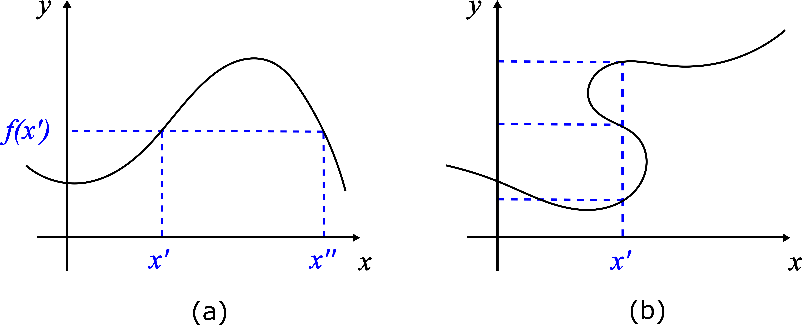

# Mathematik- und Statistik-Grundlagen {#basics}

In diesem Kapitel repetieren wir die wichtigsten Grundlagen aus der Mathematik und Statistik, die es braucht, um Machine Learning Modelle zu verstehen. Das Thema *Lineare Algebra* wird für die meisten von Ihnen wahrscheinlich Neuland sein.

## Funktionen

Eine Funktion, die wir in der Mathematik typischerweise mit $f$ bezeichnen, ordnet jedem **Argument** $x$ aus dem Definitionsbereich $D$ (engl. *Domain*) **genau einen Wert $y$** aus dem Wertebereich $W$ (engl. *Codomain*) zu. Oft sind $D$ und $W$ die Menge der reellen Zahlen, also $\mathbb{R}$. Die Menge der reellen Zahlen enthält alle möglichen Zahlen, die Sie sich vorstellen können.^[Einzige Ausnahme sind die komplexen Zahlen.] Zum Beispiel die Zahlen $3$, $-4.247$, $\sqrt{14}$, $5/8$, etc.

Wie eine Funktion grafisch aussieht, ist aus Panel (a) der Abbildung \@ref(fig:functions)) ersichtlich. Hier zeigen wir die Form einer Funktion in einem kartesischen Koordinatensystem. Die Funktionskurve weist jedem Wert $x$ auf der x-Achse genau einen Wert $y$ auf der y-Achse zu. Der wichtigste Teil der oben aufgeführten Definition ist der Teil "genau einen Wert", denn eine Funktion kann einem Element $x$ nicht zwei oder mehr Werte zuweisen, sondern nur genau einen. Genau aus diesem Grund handelt es sich bei Panel (b) in Abbildung \@ref(fig:functions) *nicht* um eine Funktion, da gewissen $x$-Werten mehrere Werte $y$ zugeordnet werden. *Wichtig*: das heisst aber nicht, dass zwei verschiedenen $x$-Werten, nennen wir sie $x'$ und $x''$, derselbe $y$-Wert zugeordnet werden kann (vgl. Panel (a)).

<div class="figure" style="text-align: center">

<p class="caption">(\#fig:functions)(a) Eine Funktion, die jedem x-Wert genau einen y-Wert zuweist. (b) Keine Funktion. </p>
</div>

Mathematisch wird diese allgemeine Definition einer Funktion häufig wie folgt beschrieben:

$$
f : x \mapsto y
$$
Wir haben also eine Funktion $f$, die jedem Element $x$ genau einen Wert $y$ zuweist. Der Pfeil in obiger mathematischer Schreibweise beschreibt genau dieses Mapping. Wie genau dieses Mapping einem Argument $x$ den entsprechenden $y$-Wert zuordnet, wird durch die Funktion $f(x)$ beschrieben. In den folgenden Abschnitten schauen wir uns typische Beispiele von Funktionen an, angefangen mit linearen Funktionen. Doch vorher wollen wir uns kurz überlegen, warum Funktionen für das Machine Learning überhaupt wichtig sind. Ein grosser Teil des Machine Learnings, der **Supervised Learning** genannt wird, befasst sich mit dem Problem, wie eine Zielvariable $y$ mithilfe von einem oder mehreren Prädiktoren $x$ vorhergesagt werden kann. Ein Machine Learning Modell ist darum nichts anderes als eine Funktion $y=f(x)$, die basierend auf den Prädiktoren $x$ die Zielvariable $y$ möglichst gut beschreiben kann.^[Zumindest aus einer nicht-probabilistischen Perspektive.]

### Lineare Funktionen

Nun schauen wir uns an, wie eine **lineare** Funktion aussieht. Eine lineare Funktion kann allgemein wie folgt geschrieben werden:

$$
y = f(x) = a \cdot x + b
$$
Obige Funktionsgleichung besagt, dass wir den entsprechenden $y$-Wert kriegen, indem wir den Wert des Arguments $x$ mit $a$ multiplizieren und danach eine Konstante $b$ addieren. $a$ und $b$ sind die **Parameter** dieser Funktion. Die konkreten Zahlenwerte dieser beiden Parameter definieren, wie die Funktion am Schluss genau aussieht.

Eine lineare Funktion hat auch eine geometrische Interpretation und zwar entspricht eine lineare Funktion einer Gerade. Das ist auch der Grund, warum wir diese Funktionen **linear** nennen, sie können graphisch durch eine "Linie" dargestellt werden. Der Parameter $a$ ist die Steigung dieser Geraden und der Parameter $b$ entspricht dem Ort, wo die Gerade die y-Achse schneidet (sogenannter y-Achsenabschnitt).

Am besten schauen wir uns ein paar konkrete Beispiele an (Abb. \@ref(fig:lin-func)).

<div class="figure" style="text-align: center">

<p class="caption">(\#fig:lin-func)Beispiele linearer Funktionen.</p>
</div>

Aus der linken Abbildung können wir ablesen, dass die Steigung dieser Geraden $\frac{\Delta y}{\Delta x}=\frac{2}{2}=1$ ist und dass die Gerade die y-Achse am Ort $1$ schneidet. Die entsprechende lineare Funktion kann dementsprechend als $y = x + 1$ geschrieben werden.^[Wir müssen hier die Steigung $1$ nicht explizit schreiben, aber selbstverständlich ist es nicht falsch die lineare Funktion als $y = 1\cdot x + 1$ zu schreiben.]

Aus der rechten Abbildung können wir ablesen, dass die Steigung $\frac{\Delta y}{\Delta x}=\frac{-1}{2}=-0.5$ ist und dass die Gerade die y-Achse am Ort $-2$ schneidet. Die entsprechende lineare Funktion kann dementsprechend als $y = -0.5\cdot x -2$ geschrieben werden.

Es ist wichtig zu sehen, dass der Effekt einer Veränderung von $x$ (also $\Delta x$) auf $y$ überall derselbe ist. Es spielt also keine Rolle, ob wir von $x=-2$ zu $x=-1$ gehen oder von $x=100$ zu $x=101$, die entsprechende Veränderung in $y$ (also $\Delta y$) wird dieselbe sein. Das muss so sein, denn die Gerade steigt (oder sinkt) mit konstanter Steigung.

::: {.rmdtip}
**Aufgaben**

1. Zeichnen Sie die Funktion $y = 2\cdot x$ in ein Koordinatensystem ein. Warum fehlt der Parameter $b$?
2. Zeichnen Sie die Funktion $y=-3$ in ein Koordinatensystem ein. Ist das überhaupt eine Funktion nach obiger Definition?
:::

### Quadratische Funktionen

Nun wollen wir uns eine etwas interessantere (und flexiblere) Familie von Funktionen anschauen, nämlich **quadratische** Funktionen. Auch hier wollen wir die Funktion erstmal allgemein aufschreiben:

$$
y = f(x) = a \cdot x^2 + b \cdot x + c
$$
Eine quadratische Funktion hat drei **Parameter**, nämlich $a$, $b$ und $c$. Grafisch entspricht die quadratische Funktion einer **Parabel** (vgl. Abb. \@ref(fig:quad-func)). Die Parameter sind hier nicht mehr so einfach grafisch zu interpretieren, aber die vier Beispiele in unten stehender Abbildung geben Anhaltspunkte, was passiert, wenn die Parameterwerte sich ändern.

<div class="figure" style="text-align: center">

<p class="caption">(\#fig:quad-func)Beispiele quadratischer Funktionen.</p>
</div>

::: {.rmdtip}
**Aufgaben**

1. Sie haben folgende quadratische Gleichung: $y = 2 \cdot x^2 + x - 2$. Berechnen Sie mit der bekannten Lösungsformel $x_{1,2}=\frac{-b \pm \sqrt{b^2 - 4ac}}{2a}$ die Orte auf der x-Achse, wo die Parabel die Achse schneidet (oder einfacher gesagt die Nullstellen).
2. Verwenden Sie folgenden R-Code, um beliebige quadratische Funktionen grafisch darzustellen, indem Sie die Parameterwerte auf der ersten Code-Zeile verändern.

```r
# Parameter setzen
a <- 2; b <- 0; c <- 1
# Quadratische Funktion
quad <- function(x, a, b, c) {a * x^2 + b * x + c}
# x-Werte
x <- seq(-6, 6, 0.01)
# y-Werte
y <- quad(x, a, b, c)
# Plot
plot(x, y, type = "l", lwd = 2, col = "darkcyan")
```
:::

Sie wundern sich nun vielleicht, könnte man nicht auch eine Funktion antreffen, in der $x^3$, $x^4$, etc. vorkommen? Das ist selbstverständlich möglich. In diesem Fall spricht man dann von einem sogenannten **Polynom**. Die höchste Potenz des Arguments $x$ definiert den Grad des Polynoms. 

Schauen wir uns doch am besten gleich wieder ein Beispiel an:

$$
y = f(x) = 1 \cdot x^4 - 2 \cdot x^3 - 5 \cdot x^2 + 8 \cdot x - 2
$$
Die Visualisierung dieser Funktion ist in Abb. \@ref(fig:poly-func) gegeben. Diese Funktion ist nun bereits enorm flexibel und kann je nach Parameterwerten ganz unterschiedliche Zusammenhänge abbilden.

<div class="figure" style="text-align: center">

<p class="caption">(\#fig:poly-func)Beispiel einer polynomischen Funktion vierten Grades.</p>
</div>

::: {.rmdtip}
**Aufgaben**

1. Eine quadratische Funktion ist ein Polynom welchen Grades?
2. Handelt es sich bei der Funktion $y=2x^5 + x + 1$ immer noch um ein Polynom? Falls ja, ein Polynom welchen Grades?
3. Handelt es sich bei der Funktion $y = x^{0.5} + 2$ um ein Polynom?
:::

### Funktionen mehrerer Argumente

Bisher haben wir nur Funktionen mit **einem Argument** $x$ angeschaut, doch die meisten für das Machine Learning interessanten Funktionen sind Funktionen **mehrerer Argumente**.

Der Einfachheit halber schauen wir uns hier nur mal eine **lineare** Funktion zweier Argumente, nennen wir sie $x_1$ und $x_2$, an, denn diese können wir in 3D immer noch visualisieren. Wir betrachten folgende Funktion: $y = f(x_1,x_2) = 1 \cdot x_1 + 0.5 \cdot x_2 + 5$.

<div class="figure" style="text-align: center">

<p class="caption">(\#fig:plane)Lineare Funktion zweier Argumente (Ebene).</p>
</div>

Aha! Während eine lineare Funktion eines Arguments grafisch einer Gerade entspricht, sehen wir nun, dass eine lineare Funktion zweier Argumente nichts anderes als eine Ebene darstellt. Wir sehen, dass die Ebene die y-Achse am Punkt $5$ schneidet. Etwas schwieriger zu sehen ist die Steigung der Ebene in die Richtung der $x_1$-Achse und in die Richtung der $x_2$-Achse. Sie können aber vielleicht bereits erraten, dass die (partiellen) Steigungen $1$ und $0.5$ betragen.

Die Funktion ordnet jeden möglichen Punkt $(x_1,x_2)$ einem Punkt auf der Ebene zu. Wir können zum Beispiel für den in Abb. \@ref(fig:plane) eingezeichneten Punkt $(6,4)$ den entsprechenden Punkt auf der Ebene ausrechnen:

$$ \begin{split}
y &= 1 \cdot x_1 + 0.5 \cdot x_2 + 5\\
&= 1 \cdot 6 + 0.5 \cdot 4 + 5\\
&= 13
\end{split}$$

Selbstverständlich könnten wir uns nun auch quadratische Funktionen oder Polynome mehrerer Argumente anschauen, aber darauf verzichten wir vorerst.

### Potenzen und Logarithmen

Blabla...


## Integral- und Differentialrechnung


## Lineare Algebra

<!-- used to describe linear systems -->
<!-- show example of linear system -->
<!-- general linear system of m equations in n unknowns -->
<!-- we want to find values for the n unknowns that satisfies all m equations -->

<!-- 3 ways to solve such systems -->
<!-- - substitution -->
<!-- - elimination of variables (Gaussian elimination or Gauss-Jordan elimination) -->
<!-- - matrix methods -->

<!-- can write a linear system in matrix form -->
<!-- row echelon form -->
<!-- reduced row echelon form -->

<!-- a system of two equations in two unknowns can have none, one or infinitely many solutions -->
<!-- it comes down to two lines crossing (one solution), being parallel (no solution) or coinciding (infinitely many solutions) -->

<!-- reduced row echelon form of augmented matrix is key to determine solutions -->
<!-- distinguish basic and free/nonbasic variables -->

<!-- The rank of a matrix is the number of nonzero rows in its row echelon form. -->

<!-- When does a particular system of linear equations have a solution? If and only if rank(A) = rank(\hat{A}). -->

<!-- How many solutions does it have? How do we compute them? see Facts 7.3 - 7.6 -->

<!-- What conditions on the coefficient matrix will guarantee the existence of at least one solution for any choice of bi's on the right-hand side? If and only if rank(A) = number of rows of A. -->

<!-- What conditions on the coefficient matrix will guarantee the existence of at most one solution for any choice of bi's on the right-hand side? If and only if rank(A) = number of columns of A. -->

<!-- What conditions on the coefficient matrix will guarantee the existence of a unique solution for any choice of bi's on the right-hand side? If and only if number of rows of A = number of columns of A = rank(A). Such a matrix A is nonsingular! -->
<!-- This implies that there must be as many equations as unknowns. A is a square matrix. -->

<!-- The problem of determining whether a square matrix has maximal rank is a cetral on in lin. alg. One can use the determinant of the matrix to find out. -->

## Wahrscheinlichkeitsrechnung


### Diskrete Zufallsvariablen

Wir werden später sehen, dass im Machine Learning oftmals Dinge als **Zufallsvariablen** modelliert werden. Eine Zufallsvariable $X$ ist eine Variable, für die der konkrete Wert nicht von vornherein klar ist. Wir können mit $X$ zum Beispiel das Resultat eines Münzwurfs modellieren. Die zwei möglichen Resultate sind Kopf und Zahl. Vor dem Münzwurf ist nicht klar, ob Kopf oder Zahl erscheinen wird. Genau darum modellieren wir das Resultat des Münzwurfs als Zufallsvariable.

Es gibt in diesem einfachen Beispiel nur zwei mögliche Resultate (Kopf und Zahl), d.h. die Anzahl möglicher Resultate ist endlich (= nicht unendlich). Darum handelt es sich in diesem Fall um eine **diskrete** Zufallsvariable.


## Verteilungen
